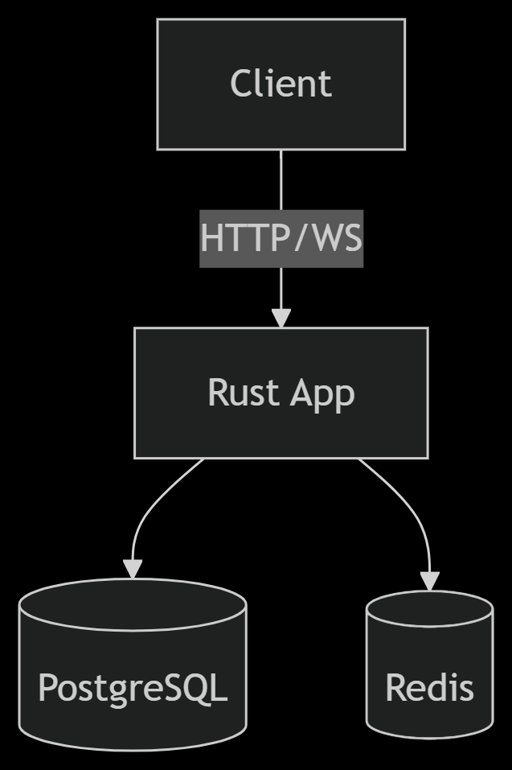

# 🚀 Axum-Rust Web Service with Auth & WebSockets

- A high-performance backend service built with Rust Axum featuring JWT authentication, role-based access control, real-time WebSocket communication, and Redis/PostgreSQL integration.

## 🌟 Features

### 🔐 Secure Authentication
- JWT-based user registration & login
- Password hashing (argon2)
- Middleware-protected routes
- Role-based access control (User, Admin)
- Claims validation for endpoint security

### 🛡️ Protected CRUD Operations
- Full user management (Create, Read, Update, Delete)
- Input validation with `validator::Validate`
- Structured error responses
- Role-guarded endpoints

### 📡 Real-Time WebSockets
- Token-authenticated connections
- Session management with Redis
- Type-safe message handling (`serde`)
- Graceful disconnection handling
- Async message processing

### 🗃️ Data Storage
- **PostgreSQL** for relational data
- **Redis** for:
  - Session storage
  - Pub/Sub (future-ready)
  - Cache management

## 🛠️ Tech Stack

| Component       | Technology              |
|-----------------|-------------------------|
| Framework       | Axum                    |
| Async Runtime   | Tokio                   |
| Database        | PostgreSQL + SQLx       |
| Cache           | Redis                   |
| Auth            | JWT + Argon2            |
| Validation      | validator crate         |
| Containerization| Docker                  |

## 🚀 Getting Started

### Prerequisites
- Rust 1.70+
- Docker & Docker Compose
- PostgreSQL 15
- Redis 7

### Installation
```bash
# Clone the repository
git clone https://github.com/your-repo/axum-webservice.git
cd axum-webservice

# Set up environment variables
cp .env.example .env
```

### Running with Docker
```bash
docker-compose up -d --build
```
*** OR ***
### Running Locally

```bash
cargo run
```

### Manual Setup
```
# Install dependencies
cargo build

# Run migrations
sqlx migrate run

# Start server
cargo run --release
```
### 📚 API Documentation
| Method | Endpoint         | Description       | Auth Required | Payload | Condition | 
| ------ | ---------------- | ----------------- | ------------- | ------------- |------------- |
| POST   | `/localhost:8055/auth/register` | User registration | No            | 	{"firstName":"user_A_firstname", "lastName":"user_A_lastname","password":"user_A_123","username":"user_A_username","email":"user_A_@gmail.com", "gender":"Male","telephone":"+234901xxxxxxxx","country":"Country","city":"City"} | All fields require |
| POST   | `/localhost:8055/auth/login`    | User login        | No            | 	{"password":"user_A_123", "username":"user_A_username","email":"user_A_@gmail.com", } | Password and {email or username} | 
| GET    | `/localhost:8055/users`         | List users        | Admin and Users | - |-|
| PUT    | `/localhost:8055/users/:id`     | Update user       | Admin and Users |-  |-| 
| DELETE    | `/localhost:8055/users/:id`     | Delete user    | Admin and Users |-  |-| 


### WebSocket Protocol
```
// Connection Init
{"type":"start_connection","token":"jwt.token.here"}

// AI Request
{"type":"ai_request","prompt":"Hello"}

// Disconnect
{"type":"disconnect","session_id":"uuid-here"}
```

### 🐳 Docker Architecture




    
### 🔧 Configuration
```
DATABASE_URL=postgres://user:pass@db:5432/app
REDIS_URL=redis://redis:6379
JWT_SECRET=your_secure_secret
```
### 📜 License
> Distributed under the MIT License.
